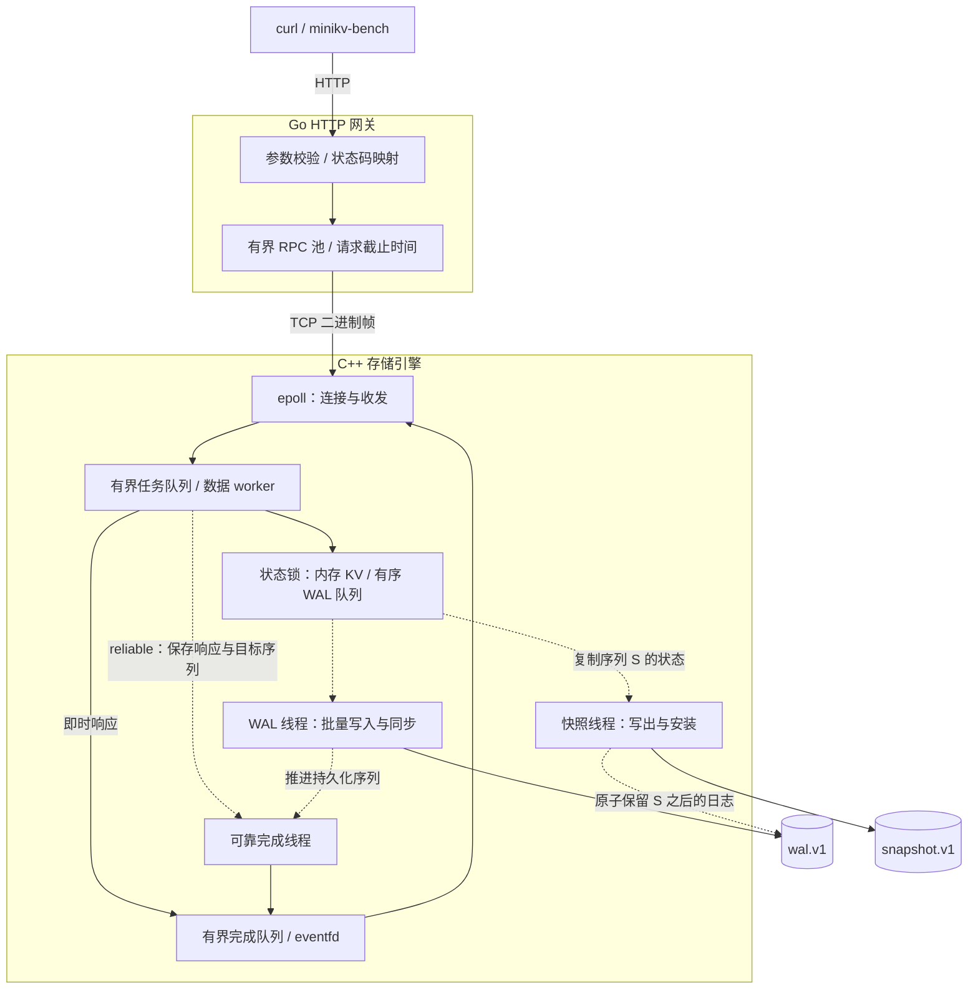

# MiniKV

**C++17 存储引擎 · Go HTTP 网关 · WAL 与快照 · 单机持久化 KV**

MiniKV 从内存数据结构、二进制协议到 HTTP 服务实现了一套单机 KV 系统。数据常驻内存，通过 WAL（预写日志）和快照恢复；项目着重解决三个问题：**成功响应承诺了什么、慢 I/O 如何影响并发、异常退出后如何验证数据。**

这也是一个以实验推动设计的系统工程项目：从可靠请求占满工作线程的问题出发，增加等待指标、进行参数与版本对照，再实现有容量限制的异步确认。设计、故障测试和实验原始记录都随仓库保留。

[快速开始](#快速开始) · [系统架构](#系统架构) · [设计与取舍](#关键设计与取舍) · [验证](#正确性如何验证) · [性能与复现](#性能基线与复现) · [后续路线](#后续路线)

| 关注点 | 已实现的能力 | 阅读入口 |
| --- | --- | --- |
| 持久化与恢复 | 两种确认语义、批量同步、CRC 与序列检查、快照及 WAL 回收 | [存储设计](docs/design.md) |
| 并发与资源控制 | `epoll` 收发、有界队列、异步可靠确认、断连后保留请求名额 | [请求生命周期](docs/design.md#异步可靠确认与请求生命周期) |
| 工程验证 | I/O 故障注入、安装边界退出、重启对账、跨进程与数据竞争检查 | [测试指南](docs/testing.md) |
| 性能分析 | 独立状态查询、确定性负载、重复实验、原始结果与资源采样归档 | [版本对照](docs/performance-async-controls.md) |

当前面向 **Linux、单机、全量内存数据集**。尚无事务、复制、鉴权、TLS、内存淘汰或数据集容量上限；队列限额只约束在途工作量。

## 快速开始

需要 Linux、C++17 编译器、CMake 3.16+、Make、Go 1.22+ 和 curl；测试与自动化实验另需 Python 3.8+。引擎使用 Linux 的 `epoll`、`eventfd` 与 `flock`，Go 程序没有第三方模块依赖。

**构建**，后续命令均在仓库根目录执行：

```sh
git clone https://github.com/GalaxyKW/MiniKV.git
cd MiniKV
make JOBS=4
```

生成 `build/engine`、`bin/minikv-go` 与 `bin/minikv-bench`。

**终端 A：启动存储引擎。** 演示显式选择可靠模式，数据保存在 `./data-demo`。

```sh
MINIKV_DATA_DIR=./data-demo \
MINIKV_WAL_MODE=reliable \
MINIKV_WAL_FLUSH_MS=2 \
./build/engine
```

看到 `MiniKV engine listening on 127.0.0.1:9090` 后，**终端 B：启动 HTTP 网关**。

```sh
MINIKV_HTTP_ADDR=127.0.0.1:8080 ./bin/minikv-go
```

**终端 C：写入并读回。** 存储操作 PUT 对应 HTTP **POST**，相同 key 会覆盖旧值。

```sh
curl -fsS -X POST http://127.0.0.1:8080/kv \
  -H 'Content-Type: application/json' \
  -d '{"key":"hello","value":"MiniKV"}'
curl -fsS 'http://127.0.0.1:8080/kv?key=hello'
```

依次输出：

```text
OK
VALUE MiniKV
```

验证重启恢复：先在终端 B、再在终端 A 按 Ctrl+C 并分别等待退出；保留 `data-demo`，重新启动两个进程，再次 GET 应读到原值。这验证正常关闭后的恢复，强制终止与 I/O 失败由[故障测试](#正确性如何验证)覆盖。

演示参数与默认值不同：默认 WAL 模式为 `throughput`，刷新触发间隔为 100 ms；网关默认 `:8080` 监听所有接口，示例仅监听本机。key 为 1–4096 字节，value 为 0–1 MiB。删除、错误码、值中空白的处理、停机备份及旧版文件迁移见[使用与配置](docs/usage.md)。

## 系统架构



Go 负责 HTTP、超时和连接复用；C++ 负责调度、内存状态与持久化。完整二进制帧才进入任务队列，空闲连接和半包不会占住 worker；同一连接按顺序处理请求。

图中实线表示请求、结果与文件写入，虚线表示后台协作。throughput 由 worker 直接投递结果，不启动可靠完成线程；reliable 只有目标序列尚未持久化时才登记等待项。两条响应路径共用请求名额和完成队列。

状态查询另有小容量的 RPC 池、工作线程和请求名额，便于数据请求积压时排查；它仍受连接总上限、状态锁和超时约束。完整模块契约见[存储与协议设计](docs/design.md)。

## 关键设计与取舍

### 成功响应意味着什么

| 模式 | PUT / DELETE 何时确认 | GET 行为 | 故障边界 |
| --- | --- | --- | --- |
| `throughput`（默认） | 内存更新且 WAL 入队 | 返回当前内存值 | 尚未同步的写入可能丢失 |
| `reliable` | 对应 WAL 批次完成 `fdatasync` | 捕获结果，等待当时的全局已应用序列持久化 | 已确认写入依赖文件系统与设备履行同步约定 |

多个写入共享一次同步，即 group commit。刷新间隔只是触发条件，排队和磁盘耗时也影响确认时间，不能据此承诺固定的最大数据丢失窗口。

超时、断连或取消后，写入结果可能未知；停止等待不会撤销已接纳的操作。网关不自动重试 PUT / DELETE，GET 最多在原超时预算内重试一次。

### 如何让后台 I/O 与请求并行

| 设计决定 | 解决的问题 | 保留的代价 |
| --- | --- | --- |
| 状态锁内统一分配序列、WAL 入队与内存更新 | 日志顺序和内存状态一致，快照只观察完整操作之间的状态 | 内存操作仍串行化；可靠 GET 可能等待其他 key 的写入 |
| WAL 写入与同步移到状态锁外 | 慢同步期间仍可执行内存操作；未同步批次继续占用字节额度 | WAL 容量满时写请求仍会阻塞 worker |
| 复制序列 S 的状态后在锁外写快照 | 快照写盘期间继续处理请求、提交 WAL，回收时保留 S 之后的新日志 | 复制持有状态锁且需要额外内存；重写 WAL 后缀会暂停其他 WAL I/O |
| 校验 CRC、连续序列与数据文件组合 | 识别损坏和关键文件缺失，避免静默打开成空库 | 仅修复不完整 WAL 尾记录；完整记录损坏时拒绝启动 |

快照文件安装失败保留原 WAL，可后续重试；WAL 写入、同步或替换失败使引擎进入失效状态。具体锁顺序、文件布局和恢复过程见[设计说明](docs/design.md)。

### 为什么异步确认仍需要容量限制

等待 WAL 的 reliable 请求保存**响应内容和目标序列**，让 worker 继续执行。完成线程在目标提交后投递原响应；GET 不会在完成时重新读取，因此之后的覆盖不会改变已捕获的值。

等待项也可能持有大 value。服务器为整个请求保留名额，覆盖排队、执行、可靠确认和完成处理：**最早在 reactor 消费或丢弃结果后释放；任务或回调仍有引用时继续保留。** 断连只移除连接，旧请求仍占名额，防止反复重连积累待完成结果。默认数据请求总名额为 `20 + 128 = 148`，响应发送缓冲另受连接数和帧大小约束。

这一设计把磁盘等待移出 worker，也引入回调所有权、异常处理和关闭顺序的问题。[生命周期契约](docs/design.md#异步可靠确认与请求生命周期)与[门控测试](tests/async_test.cpp)分别记录并验证这些边界。

### 如何判断请求在等什么

```sh
curl -fsS http://127.0.0.1:8080/stats | python3 -m json.tool
```

`/stats` 区分数据队列等待、WAL 容量等待与可靠确认等待，并提供序列、积压、请求名额、快照耗时和 RPC 池状态。可靠确认已移出 worker，活动线程数需要与在途请求量一起看。

查询不触发同步或快照，也不返回 key/value；HTTP 200 只表示状态读取成功，存储健康需看 `engine.io_failed`。计数器不跨进程重启累计，序列从文件恢复。字段及采样口径见[运行状态指南](docs/observability.md)。

## 正确性如何验证

```sh
make test
make sanitize-test
```

| 要证明的行为 | 验证方式与入口 |
| --- | --- |
| 成功确认、日志顺序与容量约束符合契约 | 暂停 WAL 同步、并发读写、恢复对账：[存储测试](tests/engine_test.cpp) |
| 异步确认不改变结果与生命周期 | 分批放行、捕获值、恰好一次回调、容量拒绝、失败与关闭排空：[异步测试](tests/async_test.cpp) |
| 快照保留并发写入，失败可辨识 | 暂停快照、检查 WAL 后缀、短写/EFBIG、安装边界退出与重复恢复：[存储测试](tests/engine_test.cpp)、[快照测试](tests/snapshot_test.cpp) |
| HTTP、RPC 和两个进程协同工作 | 参数、超时、重试、分片、RST、过载、断连名额、SIGKILL 后恢复：[Go 测试](go_server/)、[端到端测试](tests/integration_test.py) |
| 指标和实验报告可以信任 | 状态不改变提交语义；报告计数与 LSN 对账，保留失败与缺失轮次：[统计测试](tests/stats_test.cpp)、[实验测试](tests/experiment_test.py)、[汇总测试](tests/experiment_summary_test.py) |

[CI](.github/workflows/ci.yml) 配置了这两组命令：普通回归包含 Go race 检查，sanitizer 回归使用 C++ AddressSanitizer / UndefinedBehaviorSanitizer。测试使用临时数据目录和本机临时端口；进程退出测试不等同于真实断电测试。单项检查、手动 ThreadSanitizer 和各测试的覆盖边界见[测试指南](docs/testing.md)。

## 性能基线与复现

### 一个完整的工程案例：可靠确认移出 worker

最初的 reliable 负载中，数据线程接近占满，RPC 池仍有余量。进一步测量显示，主要等待来自可靠确认，而非 WAL 字节容量；据此将等待移到独立完成线程，并为待完成请求保留容量限制。

| 步骤 | 可复查的证据 | 设计判断 |
| --- | --- | --- |
| 建立基线并拆分等待指标 | [初始基线](docs/performance-baseline.md)、[指标口径](docs/observability.md#区分三种等待) | 区分排队、WAL 队列字节额度与提交确认 |
| 改变参数，再检查返回对照 | [刷新间隔 2→1→2 ms](docs/performance-controls.md)、[20→40 数据线程](docs/performance-worker-controls.md) | 确认提交等待占用 worker 的成本 |
| 实现异步确认，重跑旧版 | [18 轮版本对照及原始记录](docs/performance-async-controls.md) | 检查吞吐、尾延迟、排队与资源代价，同时回归语义 |

以下比较异步版本 **`7d29382`** 与随后重新运行的同步版本 **`25cec55`**，均为 **reliable、20 个数据线程**。每组 3 轮，表内为轮次中位数；这两批共 12 轮全部完成，系统失败为 0。

| 实现 | 自动快照 | 成功 QPS | 每轮 P99 中位数 |
| --- | --- | ---: | ---: |
| 同步版返回对照 | 关闭 | 5,128 | 10.026 ms |
| 异步确认 | 关闭 | 9,616 | 5.907 ms |
| 同步版返回对照 | 1,000 ms | 5,103 | 11.251 ms |
| 异步确认 | 1,000 ms | 9,541 | 7.253 ms |

实验条件：Xeon E3-1270 v3、Linux / NTFS3，客户端与服务端共用主机；每轮 100,000 请求、40 个闭环 worker、5,000 key、128 字节 value，20% PUT / 5% DELETE / 75% GET；RPC 池 64、WAL batch 64 / flush 2 ms。资源和状态分别每 100 / 250 ms 采样，预置不计入测量；成功 QPS 包含正常 `NOT_FOUND`。

关闭快照时，活动数据线程的样本均值中位数由 **19.74 降到 0.55**，平均排队由 **3.268 ms 降到 0.068 ms**。这表明等待位置发生了变化；可靠确认仍在等待。新版回调失败为 0，结束后两层请求名额均已释放。

这些是特定共享主机与闭环负载下的观测，执行顺序未随机交错，不能作为容量承诺。上表只覆盖所列历史版本和 reliable 模式；完整范围、每轮结果、CPU、内存和原始归档见[实验报告](docs/performance-async-controls.md)。

throughput 的验证也保留了不确定的结果：[18 轮版本返回对照](docs/performance-throughput-controls.md)发现部分慢轮，随后以相同网关和压测器完成 [16 轮引擎交错对照](docs/performance-throughput-interleaved.md)，比较 `7d29382` 与简化后的 `d2d5eb8`。这两批每轮均为 500,000 请求，全部通过操作计数和 WAL 排空检查；交错对照未观察到一致的端到端收益，不能把减少无用线程与回调构造直接写成吞吐提升。

[大数据集快照预实验](docs/performance-snapshot-pilot.md)推动了固定 64 KiB 写缓冲与部分写失败后的恢复验证。在 100k key、1 KiB value 下，[首轮 16 轮对照](docs/performance-snapshot-controls.md)观察到写出阶段变短，但开启快照时有 **3/4 配对的 QPS 更低、P99 更高**。

[补齐相同指标后的 16 轮对照](docs/performance-snapshot-accounting.md)进一步确认：相同大小的快照文件，实际写调用从每次 **100,001 降到 1,613**，四个配对的写出耗时比中位数约 **0.682**。本轮有 **2/4 配对的 QPS 更低、P99 更高**，缓冲版还出现 **283.851 ms** 的最大延迟；未触发预声明的撤销规则，也没有通过整体性能验收。缓冲保留为局部候选，负向结果完整归档。实际捕获持锁均值仍约 **57–68 ms**，是后续需要处理的暂停来源。

### 自己运行并核对结果

实验程序会启动临时服务、为每轮创建独立数据目录并回收子进程，无需提前启动服务：

```sh
make benchmark BENCH_ARGS='--output /tmp/minikv-readme-experiment'
python3 benmark/summarize.py /tmp/minikv-readme-experiment
```

输出目录必须尚不存在。默认运行两种 WAL 模式 × 快照开关 × 3 次，每轮 20,000 请求、20 个客户端 worker、1,000 key、4 个引擎线程；这与上表不同，重跑表中负载见[版本对照复现步骤](docs/performance-async-controls.md#原始归档与复现)。

汇总会核对配置、操作计数、WAL 序列与采样区间，保留失败、缺失和中断轮次，并支持文本、JSON 与 CSV。负载由 seed 和请求编号确定，改变并发数不改变请求内容集合。完整参数、产物和证据不足时的处理见[自动化性能实验](docs/benchmark-experiments.md)；连接已有服务的单次压测见[测试指南](docs/testing.md#运行一次可复现的压测)。

快照阶段与持锁指标还可通过[离线复查命令](docs/benchmark-experiments.md#离线复查快照阶段与持锁)从归档重算：保留共同采样窗口和原始差值，区分字段缺失、真实零值与观测不足。

## 后续路线

后续以可测量的单机问题为主，每个方向先明确验收条件，再扩展实现。

| 优先级 | 方向 | 验收条件 |
| --- | --- | --- |
| P1 | 扩大异步确认的负载验证 | 在已有交错对照基础上延长运行，加入慢盘、过载和固定到达率负载，联合检查失败率、P99、请求名额与内存 |
| P2 | 缩短快照捕获持锁，继续验证写缓冲的取舍 | 使用已有的临界区与写入量指标评估状态副本方案，同时覆盖快照开关、短 value 与频繁覆盖写入；联合检查尾延迟、吞吐和内存，局部阶段变快仍需通过端到端验收 |
| P3 | 评估分段 WAL 与回收方案 | 以 P2 为依据比较实现；给出空间与暂停时间收益，并通过现有故障注入和恢复检查 |

## 文档与源码导航

| 目的 | 入口 |
| --- | --- |
| 使用：API、配置、停机、备份与迁移 | [使用指南](docs/usage.md) |
| 理解：确认语义、锁、文件与协议 | [设计说明](docs/design.md) |
| 排查：健康、等待、积压与指标口径 | [运行状态](docs/observability.md) |
| 验证：回归、数据竞争与故障边界 | [测试指南](docs/testing.md) |
| 实验：负载、结果 schema、采样与归档 | [压测报告](docs/benchmark-report.md)、[实验管理](docs/benchmark-experiments.md) |
| 阅读存储实现 | [engine.h](cpp_engine/engine.h) → [engine.cpp](cpp_engine/engine.cpp) |
| 阅读跨进程请求链路 | [Go 网关](go_server/) → [TCP 服务](cpp_engine/server.cpp) → [二进制编解码](cpp_engine/codec.h) |
| 阅读压测工具 | [benmark/](benmark/)；其中 `out/` 为修复前历史数据 |
