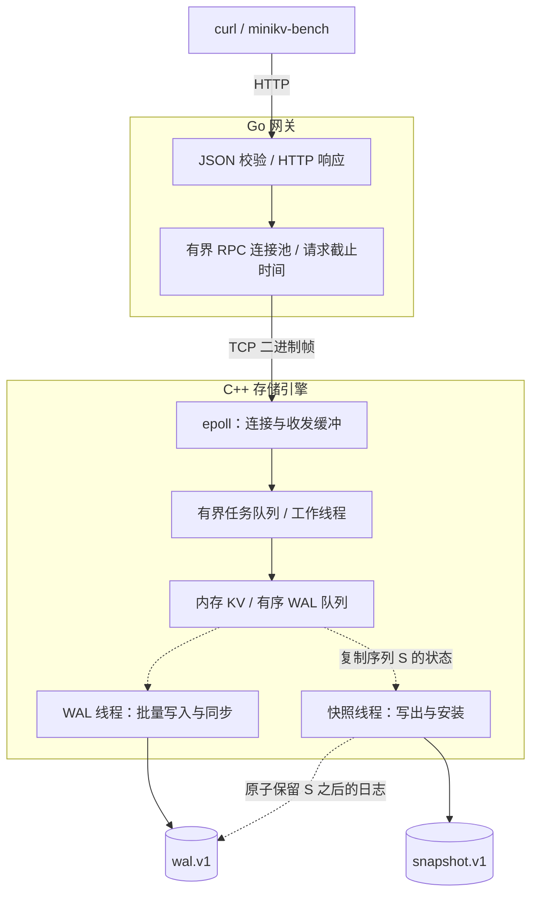

# MiniKV

**C++17 存储引擎 · Go HTTP 网关 · 单机持久化 KV**

MiniKV 将数据保存在内存中，通过 WAL（预写日志）与快照完成持久化和恢复。项目围绕三个问题展开：**写入何时可以确认成功、后台 I/O 如何与请求并行、故障后如何验证数据仍然正确。**

[快速开始](#快速开始) · [系统架构](#系统架构) · [运行状态](#运行状态) · [设计与取舍](#关键设计与取舍) · [测试](#正确性如何验证) · [压测](#可复现压测) · [后续路线](#后续路线)

- **明确的提交语义**：提供 `throughput` 与 `reliable` 两种模式，区分内存可见和 WAL 已同步。
- **并发持久化**：WAL 批量提交，快照文件写盘期间继续处理请求和提交 WAL，回收时保留快照生成期间的新日志。
- **可重复的故障验证**：在写入、同步、rename 等边界注入失败或退出进程，再通过重启、读取和继续写入检查恢复结果。
- **可观察的运行状态**：通过 `/stats` 读取 WAL 积压、提交与快照耗时、请求队列和 RPC 池数据。

## 系统架构



实线展示请求与文件写入路径，虚线展示后台持久化和日志回收。快照按周期触发，也可由引擎内部接口调用。

Go 网关负责 HTTP 参数校验、超时和连接复用；C++ 引擎负责请求调度、内存状态与持久化。TCP 使用带长度和状态码的二进制帧；`epoll` 管理连接收发，完整请求才进入工作队列，因此空闲连接和半包不会占住工作线程。

图中展示 KV 请求主路径。状态查询使用独立且有容量上限的 RPC 池和引擎工作线程，让数据请求等待 WAL 时仍可观察积压。

## 快速开始

### 1. 构建

需要 **Linux、C++17 编译器、CMake 3.16+、Make 和 Go 1.22+**。引擎依赖 Linux 的 `epoll`、`eventfd` 和 `flock`；Go 程序没有第三方模块依赖。端到端测试另需 Python 3，以下 HTTP 示例使用 curl。

```sh
git clone https://github.com/GalaxyKW/MiniKV.git
cd MiniKV
make JOBS=4
```

生成 `build/engine`、`bin/minikv-go` 和 `bin/minikv-bench`。以下命令均在**仓库根目录**执行。

### 2. 启动两个进程

终端 A：启动引擎，使用独立的演示数据目录。

```sh
MINIKV_DATA_DIR=./data-demo \
MINIKV_WAL_MODE=reliable \
MINIKV_WAL_FLUSH_MS=2 \
./build/engine
```

看到 `MiniKV engine listening on 127.0.0.1:9090` 后，在终端 B 启动网关：

```sh
MINIKV_HTTP_ADDR=127.0.0.1:8080 ./bin/minikv-go
```

示例选择 `reliable` 模式和 2 ms 刷新触发间隔，程序默认值是 `throughput` 和 100 ms。网关示例仅监听本机；其默认地址 `:8080` 会监听所有接口。完整参数见[使用与配置](docs/usage.md#配置参考)。

如需打开旧版 `data.db` / `wal.log`，先按[迁移步骤](docs/usage.md#旧版数据迁移)操作。

### 3. 写入并读回

在终端 C 执行。存储操作 PUT 对应 **HTTP POST**，相同 key 会覆盖旧值。

```sh
curl -fsS -X POST http://127.0.0.1:8080/kv \
  -H 'Content-Type: application/json' \
  -d '{"key":"hello","value":"MiniKV"}'
```

预期输出：

```text
OK
```

```sh
curl -fsS 'http://127.0.0.1:8080/kv?key=hello'
```

预期输出：

```text
VALUE MiniKV
```

### 4. 验证重启恢复，再删除

先在终端 B 按 Ctrl+C，等待网关退出；再在终端 A 按 Ctrl+C，等待引擎退出。保留 `./data-demo`，重新执行第 2 步的两条启动命令，再执行 GET，应仍得到 `VALUE MiniKV`。

这个演示验证正常关闭后的恢复；进程强制终止和 I/O 失败由下文的故障测试覆盖。关闭时会同步剩余 WAL，磁盘阻塞可能延长退出时间。

```sh
curl -fsS -X DELETE 'http://127.0.0.1:8080/kv?key=hello'
curl -sS -w 'HTTP %{http_code}\n' 'http://127.0.0.1:8080/kv?key=hello'
```

预期输出：

```text
OK
NOT_FOUND
HTTP 404
```

key 为 1–4096 字节，value 为 0–1 MiB。GET/DELETE 的 key 使用 URL 编码；读取值时只移除 `VALUE ` 前缀和响应末尾的一个换行，以保留值本身的空白。完整响应格式与错误码见 [HTTP API](docs/usage.md#http-api)。

## 运行状态

服务运行时查询聚合状态：

```sh
curl -sS http://127.0.0.1:8080/stats | python3 -m json.tool
```

响应包含引擎的已应用 / 已持久化序列、未同步 WAL 字节、提交与快照阶段耗时，以及数据任务队列、工作线程和网关 RPC 池状态。查询不触发同步或快照，也不返回 key/value。

计数器随对应进程重启归零，序列从数据文件恢复。状态查询仍受连接总上限、状态锁和超时约束；HTTP 200 表示成功读取状态，检查存储健康还需查看 `engine.io_failed`。字段口径和故障响应见[运行状态指南](docs/observability.md)。

## 关键设计与取舍

### 成功响应意味着什么

| 模式 | PUT / DELETE 何时确认 | GET 行为 | 故障后的边界 |
| --- | --- | --- | --- |
| `throughput`（默认） | 内存更新且 WAL 入队 | 返回当前内存值 | 尚未同步的写入可能丢失 |
| `reliable` | 对应 WAL 批次完成 `fdatasync` | 等待读取时观察到的全局序列持久化 | 已确认写入的持久性依赖文件系统与设备履行同步约定 |

多个写请求可以共享一次同步（group commit）。刷新间隔是触发条件，磁盘耗时与排队也影响提交时间，不能据此承诺固定的最大数据丢失窗口。

超时、断连或客户端取消后，写入结果可能未知；停止等待不会撤销已提交给引擎的操作。网关不自动重试 PUT / DELETE，GET 最多在原超时预算内重试一次。

### 为什么这样实现

| 问题 | 实现方式 | 代价与限制 |
| --- | --- | --- |
| 日志顺序与内存状态如何一致 | 在状态锁内分配日志序列、加入 WAL 队列并更新内存 | 内存操作仍串行化；可靠 GET 可能等待其他 key 的写入 |
| 慢磁盘如何影响请求 | WAL 线程在状态锁外写入并同步，正在同步的批次仍计入队列额度 | 队列满时写请求等待；可靠模式仍受磁盘延迟约束 |
| 快照期间的新写入如何保留 | 复制序列 S 的状态，持久化快照后原子替换 WAL，保留 S 之后的日志 | 复制数据仍持有状态锁并需要额外内存；重写 WAL 后缀会暂停其他 WAL I/O |
| 半包与过载如何处理 | `epoll` 收齐帧后派发；连接数、任务队列和 RPC 池均有上限 | 各层通过等待、BUSY 或关闭新连接限制负载；容量并非无限 |
| 如何避免把损坏当作空库 | 检查 CRC、连续日志序列和文件组合，仅修复不完整 WAL 尾记录 | 完整记录损坏或关键文件缺失时拒绝启动，需要检查存储并恢复备份 |

快照文件安装失败时保留原 WAL，允许后续重试；WAL 写入、同步或替换失败会使引擎拒绝后续请求。文件格式、锁顺序与恢复边界见[存储与协议设计](docs/design.md)。

## 正确性如何验证

```sh
make test
make sanitize-test
```

| 要验证的行为 | 验证方法 | 测试入口 |
| --- | --- | --- |
| WAL 顺序、批次确认与队列额度 | 并发读写、暂停同步、排空后重启读取 | [engine_test.cpp](tests/engine_test.cpp) |
| 快照不丢失并发写入 | 暂停快照写盘，完成可靠读写，再恢复并检查 WAL 后缀 | [snapshot_test.cpp](tests/snapshot_test.cpp) |
| 失败后不会静默接受损坏 | I/O 故障注入、真实短写/EFBIG、安装边界退出进程、重复恢复 | [存储测试](tests/engine_test.cpp)、[快照测试](tests/snapshot_test.cpp) |
| HTTP 与 RPC 契约 | 参数、错误码、连接池、取消、超时与重试测试，启用 Go race 检查 | [main_test.go](go_server/main_test.go)、[client_test.go](go_server/client_test.go) |
| 状态查询不改变提交语义 | 暂停 WAL / 快照、验证失败计数与重启；数据队列和 RPC 池占满时读取状态 | [存储统计测试](tests/stats_test.cpp)、[网关统计测试](go_server/stats_test.go)、[端到端测试](tests/integration_test.py) |
| 两个进程协同工作 | TCP 分片与流水线、1 MiB value、RST、过载、停机响应、SIGKILL 后恢复 | [integration_test.py](tests/integration_test.py) |

[CI 工作流](.github/workflows/ci.yml) 配置了上述两组命令；第二组使用 AddressSanitizer / UndefinedBehaviorSanitizer 检查 C++。测试使用临时目录和本机临时端口，进程退出测试不等同于真实断电测试。

单项测试、手动 ThreadSanitizer 检查和环境要求见[测试指南](docs/testing.md#运行回归检查)。

## 可复现压测

使用快速开始中的演示数据目录，在引擎和网关运行时执行：

```sh
./bin/minikv-bench \
  -url http://127.0.0.1:8080/kv \
  -workers 20 -requests 20000 -op mixed \
  -keyspace 1000 -preload-count 1000 \
  -write-ratio 20 -delete-ratio 5 \
  -value-size 128 -seed 1
```

这会预热并修改 `k0` 至 `k999`。报告包含总 QPS、成功吞吐量（含正常未命中）、P50/P95/P99/P99.9、错误数和状态码分布。延迟统计包含失败请求，预热耗时不计入测量；预热失败或出现系统失败时，工具以非零状态退出。

增加 `-format json` 可保存带版本的客户端配置、实际操作数和分类错误报告。负载按 seed 和请求编号生成，改变并发数不会改变请求内容的集合；并发交错与命中率仍可能变化。参数与报告字段见[压测报告指南](docs/benchmark-report.md)。

比较时应固定提交、硬件、构建类型、持久化模式和负载，分别报告两种模式的结果，并保留原始输出。当前工具采用固定并发的闭环负载，服务变慢时发送速率也会下降；判断过载容量还需要固定到达速率实验。

实验记录要求、快照代价与指标口径见[测试与性能实验](docs/testing.md#运行一次可复现的压测)。`benmark/out/` 中的历史结果来自修复前版本，不能用作当前版本的性能结论。

## 后续路线

当前实现面向单机、全量内存数据集，没有内存淘汰或磁盘容量上限；队列限额不限制整个数据集大小。鉴权、TLS、事务和复制尚未实现。

接下来优先把现有设计变成可观测、可比较的工程结果：

| 优先级 | 方向 | 完成标准 |
| --- | --- | --- |
| P1 | 完善运行观测 | 已提供队列、持久化进度和累计耗时；继续补充请求排队耗时、延迟分布，并测量采样开销 |
| P2 | 建立性能基线 | 为两种持久化模式保存可重跑的配置与原始结果，联合报告成功吞吐量、尾延迟、错误率和内存峰值 |
| P3 | 评估快照与日志回收方案 | 在现有故障测试下比较分段 WAL、减少状态复制等方案，量化暂停时间、内存和写放大再决定实现 |

## 文档与源码导航

| 想了解什么 | 从这里开始 |
| --- | --- |
| 完整配置、HTTP API、停机备份与迁移 | [使用与配置](docs/usage.md) |
| 运行指标、计数边界与状态查询故障 | [运行状态指南](docs/observability.md) |
| 提交顺序、锁、文件格式与故障模型 | [存储与协议设计](docs/design.md) |
| 回归测试、数据竞争检查与性能实验 | [测试与性能实验](docs/testing.md) |
| 压测参数、确定性负载与 JSON 结果 | [压测报告指南](docs/benchmark-report.md) |
| 内存状态、WAL、快照与恢复 | [cpp_engine/engine.cpp](cpp_engine/engine.cpp) |
| TCP 连接管理与二进制编码 | [cpp_engine/server.cpp](cpp_engine/server.cpp)、[codec.h](cpp_engine/codec.h) |
| HTTP 网关与 RPC 连接池 | [go_server/](go_server/) |
| 压测工具与绘图 | [benmark/](benmark/) |
