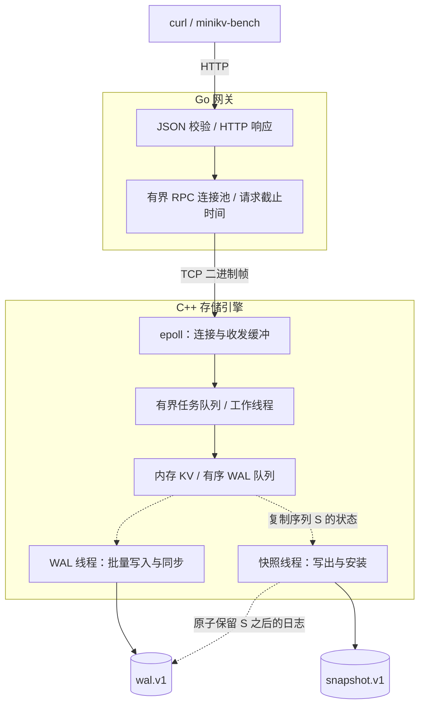

# MiniKV

**C++17 存储引擎 · Go HTTP 网关 · 单机持久化 KV**

MiniKV 是一个从存储引擎到 HTTP 接口的单机 KV 项目。数据常驻内存，WAL（预写日志）记录变更，快照缩短日志回放。项目围绕三个问题展开：**写入何时可以确认成功、后台 I/O 如何与请求并行、故障后如何验证数据仍然正确。**

[快速开始](#快速开始) · [系统架构](#系统架构) · [设计与取舍](#关键设计与取舍) · [测试](#正确性如何验证) · [性能基线](#性能基线与复现) · [后续路线](#后续路线)

- **明确的提交语义**：提供 `throughput` 与 `reliable` 两种模式，区分内存可见和 WAL 已同步。
- **并发持久化**：WAL 批量提交，快照文件写盘期间继续处理请求和提交 WAL，回收时保留快照生成期间的新日志。
- **可重复的故障验证**：在写入、同步、rename 等边界注入失败或退出进程，再通过重启、读取和继续写入检查恢复结果。
- **可观察的运行状态**：通过 `/stats` 读取 WAL 积压、提交与快照耗时、请求队列和 RPC 池数据。

想了解实现，可从[提交语义](#成功响应意味着什么)和[存储设计](docs/design.md)开始；想评估工程质量，可查看[故障测试](#正确性如何验证)和[附带原始记录的性能分析](docs/performance-baseline.md)。当前面向单机、全量内存数据集；鉴权、TLS、事务与复制尚未实现。

## 快速开始

### 1. 构建

需要 **Linux、C++17 编译器、CMake 3.16+、Make 和 Go 1.22+**。引擎依赖 Linux 的 `epoll`、`eventfd` 和 `flock`；Go 程序没有第三方模块依赖。测试与自动化实验另需 Python 3.8+，以下 HTTP 示例使用 curl。

```sh
git clone https://github.com/GalaxyKW/MiniKV.git
cd MiniKV
make JOBS=4
```

生成 `build/engine`、`bin/minikv-go` 和 `bin/minikv-bench`。以下命令均在**仓库根目录**执行。

### 2. 启动两个进程

终端 A：启动引擎，使用独立的演示数据目录。

```sh
MINIKV_DATA_DIR=./data-demo \
MINIKV_WAL_MODE=reliable \
MINIKV_WAL_FLUSH_MS=2 \
./build/engine
```

看到 `MiniKV engine listening on 127.0.0.1:9090` 后，在终端 B 启动网关：

```sh
MINIKV_HTTP_ADDR=127.0.0.1:8080 ./bin/minikv-go
```

示例选择 `reliable` 模式和 2 ms 刷新触发间隔，程序默认值是 `throughput` 和 100 ms。网关示例仅监听本机；其默认地址 `:8080` 会监听所有接口。完整参数见[使用与配置](docs/usage.md#配置参考)。

如需打开旧版 `data.db` / `wal.log`，先按[迁移步骤](docs/usage.md#旧版数据迁移)操作。

### 3. 写入并读回

在终端 C 执行。存储操作 PUT 对应 **HTTP POST**，相同 key 会覆盖旧值。

```sh
curl -fsS -X POST http://127.0.0.1:8080/kv \
  -H 'Content-Type: application/json' \
  -d '{"key":"hello","value":"MiniKV"}'
```

预期输出：

```text
OK
```

```sh
curl -fsS 'http://127.0.0.1:8080/kv?key=hello'
```

预期输出：

```text
VALUE MiniKV
```

### 4. 验证重启恢复，再删除

先在终端 B 按 Ctrl+C，等待网关退出；再在终端 A 按 Ctrl+C，等待引擎退出。保留 `./data-demo`，重新执行第 2 步的两条启动命令，再执行 GET，应仍得到 `VALUE MiniKV`。

这个演示验证正常关闭后的恢复；进程强制终止和 I/O 失败由下文的故障测试覆盖。关闭时会同步剩余 WAL，磁盘阻塞可能延长退出时间。

```sh
curl -fsS -X DELETE 'http://127.0.0.1:8080/kv?key=hello'
curl -sS -w 'HTTP %{http_code}\n' 'http://127.0.0.1:8080/kv?key=hello'
```

预期输出：

```text
OK
NOT_FOUND
HTTP 404
```

key 为 1–4096 字节，value 为 0–1 MiB。GET/DELETE 的 key 使用 URL 编码；读取值时只移除 `VALUE ` 前缀和响应末尾的一个换行，以保留值本身的空白。完整响应格式与错误码见 [HTTP API](docs/usage.md#http-api)。

## 系统架构



实线展示请求与文件写入路径，虚线展示后台持久化和日志回收。快照按周期触发，也可由引擎内部接口调用。

Go 网关负责 HTTP 参数校验、超时和连接复用；C++ 引擎负责请求调度、内存状态与持久化。TCP 使用带长度和状态码的二进制帧；`epoll` 管理连接收发，完整请求才进入工作队列，因此空闲连接和半包不会占住工作线程。

图中展示 KV 请求主路径。状态查询使用独立且有容量上限的 RPC 池和引擎工作线程，让数据请求等待 WAL 时仍可观察积压。

## 运行状态

服务运行时查询聚合状态：

```sh
curl -sS http://127.0.0.1:8080/stats | python3 -m json.tool
```

响应包含引擎的已应用 / 已持久化序列、未同步 WAL 字节、提交与快照阶段耗时，以及数据任务队列、工作线程和网关 RPC 池状态。新增等待指标区分请求排队、WAL 容量等待与可靠确认等待，便于解释线程占用。查询不触发同步或快照，也不返回 key/value。

计数器随对应进程重启归零，序列从数据文件恢复。状态查询仍受连接总上限、状态锁和超时约束；HTTP 200 表示成功读取状态，检查存储健康还需查看 `engine.io_failed`。字段口径和故障响应见[运行状态指南](docs/observability.md)。

## 关键设计与取舍

### 成功响应意味着什么

| 模式 | PUT / DELETE 何时确认 | GET 行为 | 故障后的边界 |
| --- | --- | --- | --- |
| `throughput`（默认） | 内存更新且 WAL 入队 | 返回当前内存值 | 尚未同步的写入可能丢失 |
| `reliable` | 对应 WAL 批次完成 `fdatasync` | 等待读取时观察到的全局序列持久化 | 已确认写入的持久性依赖文件系统与设备履行同步约定 |

多个写请求可以共享一次同步（group commit）。刷新间隔是触发条件，磁盘耗时与排队也影响提交时间，不能据此承诺固定的最大数据丢失窗口。

超时、断连或客户端取消后，写入结果可能未知；停止等待不会撤销已提交给引擎的操作。网关不自动重试 PUT / DELETE，GET 最多在原超时预算内重试一次。

### 为什么这样实现

| 问题 | 实现方式 | 代价与限制 |
| --- | --- | --- |
| 日志顺序与内存状态如何一致 | 在状态锁内分配日志序列、加入 WAL 队列并更新内存 | 内存操作仍串行化；可靠 GET 可能等待其他 key 的写入 |
| 慢磁盘如何影响请求 | WAL 线程在状态锁外写入并同步，正在同步的批次仍计入队列额度 | 队列满时写请求等待；可靠模式仍受磁盘延迟约束 |
| 快照期间的新写入如何保留 | 复制序列 S 的状态，持久化快照后原子替换 WAL，保留 S 之后的日志 | 复制数据仍持有状态锁并需要额外内存；重写 WAL 后缀会暂停其他 WAL I/O |
| 半包与过载如何处理 | `epoll` 收齐帧后派发；连接数、任务队列和 RPC 池均有上限 | 各层通过等待、BUSY 或关闭新连接限制负载；容量并非无限 |
| 如何避免把损坏当作空库 | 检查 CRC、连续日志序列和文件组合，仅修复不完整 WAL 尾记录 | 完整记录损坏或关键文件缺失时拒绝启动，需要检查存储并恢复备份 |

快照文件安装失败时保留原 WAL，允许后续重试；WAL 写入、同步或替换失败会使引擎拒绝后续请求。文件格式、锁顺序与恢复边界见[存储与协议设计](docs/design.md)。

## 正确性如何验证

```sh
make test
make sanitize-test
```

| 要验证的行为 | 验证方法 | 测试入口 |
| --- | --- | --- |
| WAL 顺序、批次确认与队列额度 | 并发读写、暂停同步、排空后重启读取 | [engine_test.cpp](tests/engine_test.cpp) |
| 快照不丢失并发写入 | 暂停快照写盘，完成可靠读写，再恢复并检查 WAL 后缀 | [snapshot_test.cpp](tests/snapshot_test.cpp) |
| 失败后不会静默接受损坏 | I/O 故障注入、真实短写/EFBIG、安装边界退出进程、重复恢复 | [存储测试](tests/engine_test.cpp)、[快照测试](tests/snapshot_test.cpp) |
| HTTP 与 RPC 契约 | 参数、错误码、连接池、取消、超时与重试测试，启用 Go race 检查 | [main_test.go](go_server/main_test.go)、[client_test.go](go_server/client_test.go) |
| 状态查询不改变提交语义 | 暂停 WAL / 快照、验证失败计数与重启；数据队列和 RPC 池占满时读取状态 | [存储统计测试](tests/stats_test.cpp)、[网关统计测试](go_server/stats_test.go)、[端到端测试](tests/integration_test.py) |
| 两个进程协同工作 | TCP 分片与流水线、1 MiB value、RST、过载、停机响应、SIGKILL 后恢复 | [integration_test.py](tests/integration_test.py) |
| 性能结果可复查 | 完整实验矩阵、失败与中断保留、报告计数与 LSN 对账、进程身份和采样区间验证 | [实验管理测试](tests/experiment_test.py)、[汇总测试](tests/experiment_summary_test.py) |

[CI 工作流](.github/workflows/ci.yml) 配置了上述两组命令；第二组使用 AddressSanitizer / UndefinedBehaviorSanitizer 检查 C++。测试使用临时目录和本机临时端口，进程退出测试不等同于真实断电测试。

单项测试、手动 ThreadSanitizer 检查和环境要求见[测试指南](docs/testing.md#运行回归检查)。

## 性能基线与复现

初始基线保存了提交 `7c488b7` 的 **24 轮原始实验记录**：两种 WAL 模式 × 快照开关 × 3 次重复，分别开启和关闭周期采样。以下为开启采样的 12 轮结果，每组列出轮次中位数；全部完成，系统失败为 0。成功 QPS 包含符合协议的 `NOT_FOUND`，不代表全部命中。

| 模式 | 自动快照 | 成功 QPS | 每轮 P99 中位数 |
| --- | --- | ---: | ---: |
| throughput | 关闭 | 32,011 | 2.505 ms |
| throughput | 1,000 ms | 31,422 | 2.595 ms |
| reliable | 关闭 | 5,132 | 10.023 ms |
| reliable | 1,000 ms | 5,100 | 11.129 ms |

条件：Xeon E3-1270 v3、Linux / NTFS3，客户端和服务端共用主机；每轮 100,000 请求、40 个闭环 worker、5,000 key、128 字节 value，20% PUT / 5% DELETE / 75% GET；引擎 20 线程、RPC 池 64、WAL batch 64 / flush 2 ms。资源和状态分别每 100 / 250 ms 采样，预置不计入测量。

两种模式的确认语义不同，不能只看 QPS 判断优劣。可靠模式关闭快照时，各轮 P99 为 **10.022–15.523 ms**，存在慢轮次；同机负载也未完全受控。当前样本不足以证明快照成本可忽略，或把两批差值全部归为采样开销。完整范围、环境、等待分析与原始归档见[性能基线](docs/performance-baseline.md)。这些结果是特定条件下的观测，不是容量承诺。

后续还完成了 12 轮[刷新间隔 2→1→2 ms 的控制实验](docs/performance-controls.md)：提交周期和吞吐量随参数改变并返回，为定位可靠模式的等待来源提供了进一步证据。

### 自己运行并核对结果

以下使用实验程序的默认负载配置，自行启动临时服务、保存每轮独立数据并回收子进程，无需提前启动引擎或网关：

```sh
make benchmark BENCH_ARGS='--output /tmp/minikv-readme-experiment'
python3 benmark/summarize.py /tmp/minikv-readme-experiment
python3 benmark/summarize.py /tmp/minikv-readme-experiment --format json > /tmp/minikv-readme-summary.json
```

输出目录必须尚不存在。默认运行 4 种配置、每种 3 次，每轮 20,000 请求、20 个客户端 worker、1,000 key、4 个引擎线程；这与上表的负载不同。重跑上表配置见[基线复现步骤](docs/performance-baseline.md#原始记录与复查)。

汇总直接核对原始报告、配置、WAL 序列和观测样本，保留失败、缺失与中断轮次；可输出文本、JSON 或 CSV。不同输入目录分别统计，缺失资源值使用 `null`。快照开启却未在测量区间内观察到活动时，会明确标记证据不足。

需要连接已有服务做单次压测，见[压测命令与指标口径](docs/testing.md#运行一次可复现的压测)；实验参数和产物见[自动化性能实验](docs/benchmark-experiments.md)。负载按 seed 和请求编号生成，改变并发数不会改变请求内容集合；当前采用闭环负载，评估固定外部到达速率下的容量仍需另做实验。`benmark/out/` 的旧数据来自修复前版本。

## 后续路线

当前没有内存淘汰或磁盘容量上限，队列限额不限制整个数据集大小。后续优先完善现有单机设计的观测和验证，再扩大能力范围。

首批基线的样本显示，可靠模式的数据线程接近满载、任务队列经常非空，RPC 连接池尚有余量。这支持先检查持久化等待和线程占用；具体原因仍需通过改变单个参数的对照实验验证。

| 优先级 | 方向 | 验收方式 |
| --- | --- | --- |
| P1 | 定位可靠模式的等待成本 | 使用请求排队、容量与持久化等待指标，分别比较刷新间隔、batch 阈值和线程数，同时验证确认语义 |
| P2 | 扩大基线覆盖 | 增大数据集与运行时间、交错采样开关；保留每轮原始数据，比较尾延迟、失败率与资源开销 |
| P3 | 评估快照与日志回收方案 | 比较分段 WAL、减少状态复制等方案；量化暂停时间、内存与写放大，并通过现有故障测试 |

## 文档与源码导航

| 想了解什么 | 从这里开始 |
| --- | --- |
| 完整配置、HTTP API、停机备份与迁移 | [使用与配置](docs/usage.md) |
| 运行指标、计数边界与状态查询故障 | [运行状态指南](docs/observability.md) |
| 提交顺序、锁、文件格式与故障模型 | [存储与协议设计](docs/design.md) |
| 回归测试、数据竞争检查与性能实验 | [测试与性能实验](docs/testing.md) |
| 压测参数、确定性负载与 JSON 结果 | [压测报告指南](docs/benchmark-report.md) |
| 自动启动服务、重复实验与资源采样 | [自动化性能实验](docs/benchmark-experiments.md) |
| 实测结果、等待分析与原始数据 | [性能基线](docs/performance-baseline.md) |
| 单变量参数比较与返回对照 | [WAL 刷新间隔控制实验](docs/performance-controls.md) |
| 内存状态、WAL、快照与恢复 | [cpp_engine/engine.cpp](cpp_engine/engine.cpp) |
| TCP 连接管理与二进制编码 | [cpp_engine/server.cpp](cpp_engine/server.cpp)、[codec.h](cpp_engine/codec.h) |
| HTTP 网关与 RPC 连接池 | [go_server/](go_server/) |
| 压测工具与绘图 | [benmark/](benmark/) |
