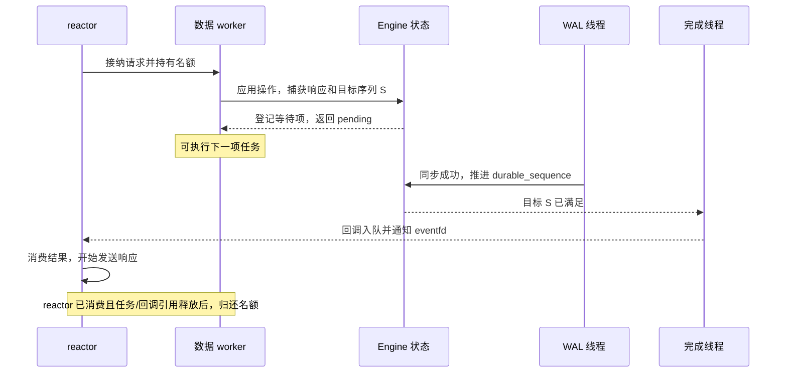

# MiniKV 存储与协议约定

## 写入、可见性和提交点

`Engine` 用状态锁统一 WAL 序列号分配、记录入队和内存变更。PUT/DELETE 的日志顺序与应用顺序一致；快照只能看到完整操作之间的状态。请求执行线程与后台持久化线程都遵守这一顺序。

后台线程在批量阈值或时间阈值到达时取出待提交批次，释放状态锁后写出记录，处理短写和 EINTR，然后调用 `fdatasync`。只有同步成功后才推进 `durable_sequence`、释放这一批次占用的队列额度并唤醒等待者。这是 group commit：同一批写入共享一次同步。

- `throughput`：操作在内存中应用、WAL 入队后即可返回。进程或机器故障可能丢失尚未同步的写入。刷新间隔是触发条件，磁盘阻塞时不能承诺固定的最大丢失时间窗口。
- `reliable`：写请求等到自己的序列号同步成功后才返回成功。GET 保存读取时的结果，并等到该结果所依赖的写入序列持久化后再返回。
- 两种模式都对后台 WAL I/O 错误进入失效状态，拒绝后续请求并输出错误；不会将失败的写入标记为已同步。
- RPC 超时、断开或取消后，写入结果可能未知。网关不会重试 PUT/DELETE；GET 至多在同一超时预算内重试一次。

## WAL I/O 与状态锁

状态锁保护内存数据、日志入队、序列号和等待条件；独立的 I/O 锁串行化 WAL 批次写入、快照边界确定、WAL 替换和最终关闭。快照锁串行化整个快照过程，防止多个快照交错安装。需要多把锁时，固定按“快照锁 → I/O 锁 → 状态锁”的顺序获取；不需要的锁可以跳过。后台线程会先释放状态锁再等待 I/O 锁，防止锁顺序反转。


I/O 锁覆盖上面整个过程，所以始终只有一个批次在写盘。快照必须等待已在写盘的批次完成，再确定自己的 WAL 边界；最后替换 WAL 时也必须持有 I/O 锁。WAL 写盘期间，新请求可以修改内存并进入下一批队列。提交点只前进到本批最后一个序列号 S，不能使用此时可能更大的 `applied_sequence`。

`MINIKV_WAL_QUEUE_BYTES` 限制的是“待写队列 + 正在写盘但尚未同步的批次”的 WAL 字节数。取出批次时不会释放额度；同步成功后才扣除该批次大小，避免慢盘期间无限接收新写入。同步失败时不推进提交点，所有等待者收到错误，后续请求被拒绝。

| 操作 | WAL 同步未完成时的行为 |
| --- | --- |
| throughput GET | 可以读取当前内存值 |
| throughput PUT/DELETE | 容量足够时可入队并返回；容量不足时等待 |
| reliable PUT/DELETE | 可入队，但必须等到自己的序列号同步成功 |
| reliable GET | 必须等到所观察的状态同步成功 |
| 快照 | 等待 I/O 锁后复制状态、确定边界；同步捕获的批次后释放 I/O 锁，写出快照 |
| 关闭 | 停止接入，唤醒并等待 WAL 与快照后台线程，等待手动快照结束，再同步剩余队列 |

自动快照使用独立的后台线程，避免快照文件写盘阻塞 WAL 刷新。快照制作只在复制内存数据时持有状态锁；随后根据不可变副本编码、计算校验和、写文件并安装，此时不持有状态锁或 I/O 锁。普通请求可以继续执行，可靠模式请求仍按各自 WAL 批次确认。手动与自动快照共享快照锁。

复制操作仍需要与数据集大小成正比的时间及额外内存，复制期间会阻塞状态访问。快照安装后，重写 WAL 后缀需要持有 I/O 锁，耗时取决于快照制作期间已经刷入 WAL 的日志量；此阶段吞吐模式请求仍可在队列有容量时执行，可靠模式请求可能等待后缀替换完成。后缀使用固定大小缓冲区复制，不把整个 WAL 再载入内存。上述改动消除了快照文件写盘时的状态锁占用，实际延迟和内存开销仍需通过压测评估。

回归测试通过暂停真实 WAL 同步边界，验证吞吐模式读写仍可完成、队列不会提前释放容量、批次之间不会提前确认，以及并发快照和关闭后的数据可恢复。`in-flight WAL acknowledgements` 还分别暂停前后两个批次，检查第一批提交后第二批及其依赖读取仍在等待。

## 异步可靠确认与请求生命周期

TCP 服务在 reliable 模式使用 `Engine::execute_async`。数据线程应用请求并保存响应结果；如果目标序列尚未持久化，就登记一个等待项并返回，继续执行其他任务。独立完成线程在目标提交后调用回调，回调将结果放入有界完成队列，通过 `eventfd` 通知 reactor 发送。WAL 容量不足仍会阻塞数据线程；这次异步化只改变可靠确认的等待位置。

throughput 模式使用 `Engine::execute`，由数据线程直接投递结果，跳过异步回调的构造；引擎也不启动可靠确认的完成线程。两种模式共用请求名额和完成队列，断连与停机的容量约束相同。直接调用吞吐模式的 `execute_async` 仍会返回即时结果，不转移回调所有权；`drain_async()` 不等待其 WAL，同步剩余 WAL 是 `close()` 的职责。



读取、比较目标与登记等待项都在同一把状态锁内完成，避免同步恰好发生在登记之间而丢失通知。GET 保存当时的 value 或未命中结果及全局 `applied_sequence`，完成时不重新读取；随后覆盖或删除不会改变已捕获的响应。删除未命中仍写入 WAL，并等待自身序列确认。

异步 API 返回有值的 `optional<Response>` 时，由调用者处理即时响应，回调不会执行；返回 `nullopt` 时，引擎接管回调并恰好调用一次，回调可能早于提交函数返回。引擎在写入生效前预留名额并分配等待节点，容量耗尽返回 BUSY，不更改内存、WAL 或序列。节点登记不再分配内存；异常只允许发生在回调接管之前，避免调用者重复发送错误响应。同步 `Engine::execute` 保留原有阻塞接口。

服务器为整个数据请求保留一个名额，上限为 `MINIKV_WORKERS + MINIKV_REQUEST_QUEUE_SIZE`，默认 148。名额从接纳开始，覆盖排队、执行、可靠确认和完成队列，至少保留到 reactor 消费或丢弃结果；提交任务或回调仍持有该名额时，还需等其引用释放。断连时只移除连接；旧请求继续持有名额，完成后凭连接 ID 丢弃结果，防止反复重连积累待完成 GET 的值副本。响应发送缓冲由连接数及单帧大小另行限制。引擎内部也有异步名额上限，TCP 服务将其设为相同容量；直接使用 Engine 时可通过 `EngineConfig::max_async_requests` 配置。

完成回调在状态、I/O 和快照锁外执行，服务器回调仅投递结果，不访问 socket 或连接表。引擎捕获回调异常、计数并继续处理其他项；异常不属于存储 I/O 失败。回调可调用 `stats()`，但必须简短，不能调用同一引擎的 `drain_async()` / `close()` 或销毁引擎；前两种重入会抛出逻辑错误。阻塞回调会拖延后续完成及排空，不能依靠脱离线程来绕过对象生命周期。

上层停止提交并结束数据 worker 后，`drain_async()` 等待已接管的回调及捕获资源释放，不等待网络发送。服务器在正常及异常退出时排空 worker 与异步回调，再关闭引擎、销毁完成通道。直接调用 `Engine::close()` 会唤醒未确认请求；尚未满足目标的请求收到关闭错误，剩余 WAL 仍按原有关闭流程同步。此时响应未成功不代表写入必定没有落盘。

## WAL 和快照文件

新文件为 `wal.v1`、`snapshot.v1`。`LOCK` 使用 `flock` 阻止两个新版引擎同时打开同一目录。数据文件权限为 0600；数据目录支持配置。并发快照沿用 v1 文件格式和恢复规则，已有 v1 数据无需迁移。

所有整数均为大端序。每条 WAL/快照记录为：

| 字段 | 字节数 |
| --- | ---: |
| magic：`MKL1` | 4 |
| 操作：PUT=1、DELETE=3 | 1 |
| 序列号 | 8 |
| key 长度 | 4 |
| value 长度 | 4 |
| key、value 原始字节 | 可变 |
| CRC32（IEEE，覆盖此前全部记录字节） | 4 |

key 为 1–4096 字节，value 为 0–1048576 字节。DELETE 的 value 长度必须为 0。长度在分配 payload 内存前验证。

快照头为 `MKVSNP01`（8 字节）、快照序列号（8 字节）、条目数（8 字节）及前 24 字节的 CRC32（4 字节）。随后恰有指定数量的 PUT 记录，各记录序列号等于快照序列号。空快照也包含完整的头部。

启动先验证并加载快照，再顺序验证 WAL。快照已覆盖的日志记录不会再次应用；新日志序列必须连续。WAL 尾部不完整的最后一条记录可以被截断修复；完整记录校验和错误、序列缺失、快照截断、额外快照字节和缺失 WAL 都会导致启动失败，不会静默跳过。若 WAL 全部被快照覆盖，恢复时会在同步快照和目录后清空旧日志，避免其尾部序列低于快照序列而使后续追加产生序列间隙。

只要 `wal.v1` 已存在，缺失 `snapshot.v1` 就会拒绝启动，包括 WAL 为空的情况：无法区分首次初始化被中断与已有数据库的快照丢失。应先保留现场并检查或恢复备份；明确不需要其中数据时才使用一个新目录初始化。

## 快照安装顺序

1. 持有快照锁，再依次获取 I/O 锁和状态锁。复制当前内存数据，记录快照序列 S，并取出当时的待提交 WAL 批次。
2. 释放状态锁，保持 I/O 锁，同步捕获的批次并按正常提交规则推进持久化序列。记录 WAL 文件末尾偏移 B，然后释放 I/O 锁。此后新写入的序列均大于 S，刷入 WAL 时位于 B 之后。
3. 用不可变副本写 `snapshot.v1.tmp`，执行 `fdatasync`。这一阶段仍持有快照锁，WAL 刷新可以并发执行。
4. 将临时文件 rename 为 `snapshot.v1`，对数据目录执行 `fsync`。此时快照 S 已持久化。
5. 重新获取 I/O 锁，将原 WAL 中 B 之后的日志以固定大小缓冲区复制到 `wal.v1.tmp`，执行 `fdatasync`。快照已经覆盖的日志不再写入新 WAL。
6. 将 `wal.v1.tmp` 原子 rename 为 `wal.v1`，切换活动文件描述符，再对数据目录执行 `fsync`。释放 I/O 锁和快照锁；后续批次追加到新 WAL。

第 3 步使用局部 64 KiB 缓冲合并头部和小记录，减少逐记录写入调用；单条编码记录大于缓冲时，先写完前面的缓冲，再直接写该记录。所有缓冲内容写完后才进入同步阶段。额外输出缓冲为固定容量，快照的内存状态副本仍随数据集增长；编码、CRC、记录顺序和文件格式不变。每次实际写入仍处理短写和 EINTR，失败立即向上传播，不在缓冲析构时补写。

快照文件写入或安装失败时保留原 WAL，后台记录错误并在后续周期重试；WAL 同步失败仍按普通提交失败处理。第 4 步完成前绝不替换 WAL。快照安装后、WAL 替换前退出，启动时通过快照序列跳过原 WAL 中已经覆盖的日志；WAL 替换过程中退出，原 WAL 和已同步的后缀 WAL 都能恢复 S 之后的已确认写入。不会整文件截断正在使用的 WAL，否则会丢掉制作快照期间的新写入。

WAL 后缀复制、同步、rename 或目录同步失败后，引擎进入失效状态，拒绝后续请求。持有 I/O 锁直到目录同步成功，保证后续批次不会先向尚未持久化安装的文件确认写入。未安装的 `snapshot.v1.tmp` 和 `wal.v1.tmp` 都不会作为恢复源。

测试在这些 I/O 边界注入错误或让子进程立即退出，并检查已确认写入可恢复；还用文件大小限制制造真实的短写/EFBIG。进程退出测试不等价于真实断电或故障存储设备测试。同步保证依赖操作系统、文件系统和设备履行 `fdatasync/fsync` 约定。

## 网络协议 v1

每条请求是 16 字节头部加 key/value：

| 字段 | 字节数 |
| --- | ---: |
| magic：`MKV1` | 4 |
| 操作：PUT=1、GET=2、DELETE=3、STATS=4 | 1 |
| 保留字段，必须为 0 | 3 |
| key 长度 | 4 |
| value 长度 | 4 |
| key、value 原始字节 | 可变 |

响应是 12 字节头部加 payload：`MKR1`（4）、状态（1）、零保留字段（3）、payload 长度（4）、payload。状态为 OK=0、VALUE=1、NOT_FOUND=2、INVALID=3、IO_ERROR=4、BUSY=5。OK/NOT_FOUND 没有 payload；VALUE 为原值，错误响应可携带错误说明。

STATS 请求的 key/value 长度必须都为 0。成功响应为 VALUE，payload 是 `schema_version: 1` 的聚合状态 JSON，包含 `engine` 和 `server`；它不属于持久化操作，不能写入 WAL。现有 PUT/GET/DELETE 的帧和文件格式保持不变；旧引擎会拒绝新增的操作。

一条连接上按顺序执行请求，支持分片、连接复用和流水线输入。`epoll` 线程管理非阻塞读写及缓冲区；工作线程只接收完整请求，不等待空闲连接。每条连接最多有一个执行中的请求，等待异步确认期间也不会开始同连接的下一项。整请求名额、工作队列、连接数量和每帧大小都有上限；请求名额或工作队列满时返回 BUSY。连接关闭后，旧任务完成结果通过唯一连接 ID 识别，不会写给复用了相同 fd 的新连接。

网关连接池同时限制空闲与活动连接的总数。请求取消和超时覆盖等待连接、拨号、写入和读取；取消回调完成后才归还连接。`/kv` 的 HTTP 响应继续使用文本格式，GET 的精确格式是 `VALUE ` + value 原始字节 + 一个换行；不能对响应整体做 TrimSpace 后当成原值。

`GET /stats` 使用独立的容量为 1 的网关 RPC 池。引擎将 STATS 派发到固定 1 个线程、1 个待执行位置的专用任务池，使用同一个 reactor 和完成队列；两个任务池均在关闭完成通知文件描述符之前排空。状态采样在工作线程中获取状态锁，不等待 durable 序列，不在 reactor 上等待锁，也不在取样时持有 I/O 锁。WAL 已失效时仍可读取状态。

专用任务池使状态查询不依赖数据 worker 的空闲程度，但它仍受引擎连接上限、快照状态复制和 RPC 超时约束。引擎、线程池、连接计数和网关分别取样，不构成跨组件原子快照；具体字段与失败响应见[运行状态指南](observability.md)。

引擎收到 SIGINT/SIGTERM 后停止接收新连接和请求，关闭空闲及未提交完整请求的连接，并给已接收请求最多 5 秒发送响应。随后等待工作队列执行完毕、异步回调排空，再同步、关闭存储并释放完成通道。这个 5 秒限制针对网络响应；磁盘 I/O 阻塞时，存储任务的执行和关闭仍可能继续等待。网关也有 5 秒 HTTP 停机宽限期，部署时应先停止网关，再停止引擎。

当 socket 截止时间先于 context 的定时回调触发时，网关仍把错误归为请求超时（HTTP 504），不会因这个竞态重试 GET。

## 旧版数据迁移

旧版文本 TCP 协议与新协议不兼容，引擎和网关需要一起更新。HTTP 的普通成功响应保持原格式；GET/DELETE 未命中现在返回 HTTP 404。

新版检测到旧 `data.db`/`wal.log` 时不会自动覆盖它们。停止旧引擎、备份整个数据目录后，执行：

```sh
MINIKV_DATA_DIR=/path/to/data ./build/engine --import-legacy
```

导入按旧格式解析并安装新的持久化快照，原文件保留不变；已有新版快照时拒绝再次导入。旧引擎没有目录锁，因此必须先停掉旧进程。旧格式本身无法无歧义表示的 key/value，以及旧版已丢失或已损坏的数据，不能通过迁移自动还原。
